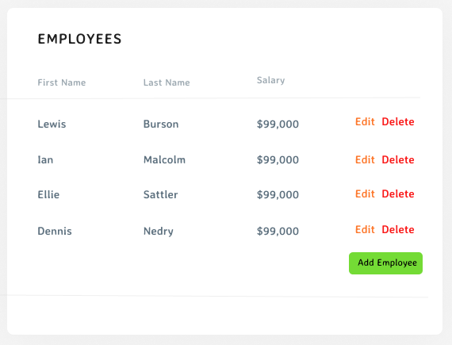

# MERN Stack Employee Table with CRUD functions

### Table of Contents

- [Goal](#goal)
- [Functional Requirements](#functional-requirements)
- [Technical Guidelines](#technical-guidelines)
- [Final Demo](#final-demo)
- [Misc](#misc)

# Goal

- Create an Employee Table like the one in the image below.
- Use any front-end framework (Angular, React, Vue, ect...) or CSS library to accomplish this.
- Implement the back-end API with a Node.js framework, and a NoSQL database

# Functional Requirements

- Initially, list all employees that are in data.json
  - First name, last name, and salary in currency format (ie. $42,000)
- The ability to edit an employee
- The ability to delete an employee
- The ability to create a new employee

# Technical Guidelines

- Structure your application and components in a modular/reusable way
- Commit code with useful and informative comments
- Your application doesn't have to use the data.json file directly, but have a SQL script to initialize your database with data found in that file
- Implement API code to read and write to a SQL database
- Styling: CSS or SCSS or SASS can be used, whichever you prefer (can use popular UI frameworks like Bootstrap as well)

# Final Demo
My demo could be downloaded at https://github.com/kwanhiuhong/Employee_Table_In_MERN_Stack/blob/master/Demo.mp4

https://user-images.githubusercontent.com/35834648/208011548-5e9c91bb-f0ce-4497-a363-78e8692fe3eb.mp4

# Misc

The MongoDB is called "employee_table_in_mern" with one collection called "Employees"

1. First link your mongodb to this project data folder
   `/Users/hiuhongkwan/Documents/Developer_Tools/MongoDB_4.4.1/mongodb-macos-x86_64-4.4.1/bin/mongod --dbpath /Users/hiuhongkwan/Desktop/Github/employee_table_in_mern/data`

2. Then call mongo to start manipulating the mongo db
   `/Users/hiuhongkwan/Documents/Developer_Tools/MongoDB_4.4.1/mongodb-macos-x86_64-4.4.1/bin/mongo`

3. Then start the server
   `node ./server/server.js`

4. Start the web application
   `npm start`
